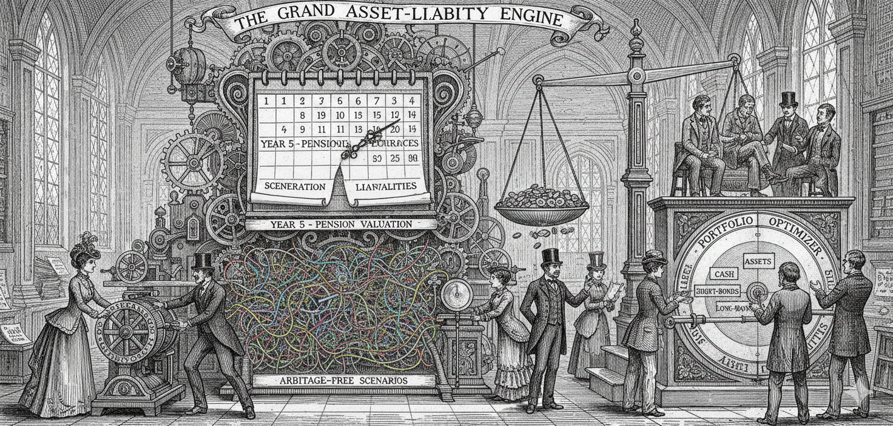

# **Asset-Liability Management (ALM) Simulation**

This project implements a stochastic Asset-Liability Management (ALM) system in Python. It demonstrates how financial institutions manage the risks that arise when the value of their assets (investments) and liabilities (obligations) respond differently to changing market conditions.

## **1\. What is ALM?**

**Asset-Liability Management (ALM)** is the practice of managing risks that arise due to mismatches between the assets and liabilities. It is not just about "maximizing returns"; it is about ensuring that the institution can meet its future obligations regardless of market movements.

### **Who uses these models?**

* **Defined Benefit Pension Funds:** They must ensure they have enough assets today to pay retirees 10, 20, or 30 years from now.  
* **Insurance Companies:** Life insurers collect premiums today and pay claims decades later. They need to ensure their investment portfolio grows in sync with those future claims.  
* **Banks:** Banks borrow short-term (deposits) and lend long-term (mortgages). They use ALM to manage the interest rate risk inherent in this mismatch.

## **2\. The Vasicek Model**

The core engine of this simulation is the **Vasicek Model**, a mathematical model for the evolution of interest rates.

### **Why use it?**

In financial engineering, we cannot simply assume interest rates will grow linearly or randomly like a stock price. Interest rates exhibit **Mean Reversion**:

1. If rates are very high, the economy slows, and central banks cut rates (pulling them down).  
2. If rates are very low, the economy overheats, and central banks raise rates (pulling them up).

The Vasicek model captures this mathematically:

$$dr_t = \kappa(\theta - r_t)dt + \sigma dW_t$$

* $\kappa$ **(Kappa):** The speed of reversion to the mean.  
* $\theta$ **(Theta):** The long-term mean interest rate.  
* $\sigma$ **(Sigma):** The volatility of rates.

Crucially, this project uses the model to generate **Arbitrage-Free** bond prices. The price of a bond in our simulation is mathematically consistent with the simulated interest rate at that specific moment.

## **3\. Stages of this ALM System**

The Python code ([`alm_simulation.py`](alm_simulation.py)) follows three distinct stages:

### **Stage 1: Scenario Generation (Stochastic Engine)**

* **Input:** Current interest rate (e.g., 5%), volatility assumptions, and time horizon.  
* **Process:** The system simulates thousands of possible future "paths" that interest rates could take over the next 10 years using the Vasicek equation.  
* **Output:** A matrix of interest rates (Simulations x Time Steps).

### **Stage 2: Liability Valuation**

* **Input:** A schedule of future cash flows (e.g., pension payouts of $500k in Year 5 and Year 10).  
* **Process:** For every simulated path, the system calculates the **Present Value (PV)** of these future liabilities.  
* **Key Insight:** When interest rates drop, the Present Value of liabilities *increases* (it costs more today to fund a future payment). This is the primary risk ALM seeks to hedge.

### **Stage 3: Stochastic Optimization**

* **Input:** Asset characteristics (Cash, 5Y Bonds, 10Y Bonds, 30Y Bonds) and the liability PV.  
* **Process:** The system uses scipy.optimize to find the optimal portfolio weights.  
* **Objective:** Maximize the expected Surplus (Assets \- Liabilities) at the investment horizon, while minimizing the volatility (Risk) of that surplus.  
* **Result:** The optimizer typically allocates to long-duration bonds (like 30Y bonds) to "immunize" the portfolio, as these assets gain value when rates drop—exactly when the liabilities also become more expensive.

## **How to Run**

1. Run the setup script: `source setup.sh`  
2. Execute the simulation: `python alm_simulation.py`  
3. View the generated dashboard: `alm_dashboard.png`